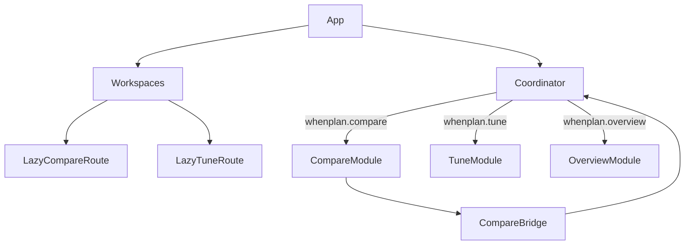

# Next Move For Chunk Splitting

## Goal

Turn the current "ineffective dynamic import" warning into a real code-splitting win without risking a broad runtime regression.

## Why The Warning Persists

The lazy import in [src/ui/theme-toggle.ts](C:/Users/Zld/16x19/16X19/src/ui/theme-toggle.ts) is not the problem by itself. `compare` is still eagerly pulled in by:

- [src/runtime/coordinator.ts](C:/Users/Zld/16x19/16X19/src/runtime/coordinator.ts): top-level `import * as ComparePage from '../ui/pages/compare/index.js'`
- [src/ui/pages/shell.ts](C:/Users/Zld/16x19/16X19/src/ui/pages/shell.ts): top-level `import * as ComparePage from './compare/index.js'`
- [src/pages/Workspaces.tsx](C:/Users/Zld/16x19/16X19/src/pages/Workspaces.tsx): static `import { Compare } from './Compare.js'`
- [src/pages/Compare.tsx](C:/Users/Zld/16x19/16X19/src/pages/Compare.tsx): static import of `initComparePage` and render helpers

There is also a cycle that makes lazy loading trickier:

- [src/runtime/coordinator.ts](C:/Users/Zld/16x19/16X19/src/runtime/coordinator.ts) calls compare render functions from `syncViews()`
- [src/ui/pages/compare/index.ts](C:/Users/Zld/16x19/16X19/src/ui/pages/compare/index.ts) calls `syncViews('compare-state-change', { compareState: true })`

## Recommended Order

### Phase 1: Cheap Wins

1. Convert `Tune` and `Compare` in [src/pages/Workspaces.tsx](C:/Users/Zld/16x19/16X19/src/pages/Workspaces.tsx) to the same `React.lazy()` pattern already used for `Optimize`.
2. Move compare-only styling off the global startup path if possible, starting with `compare.css` ownership so Compare route assets are loaded with Compare instead of from `main.tsx`.
3. Rebuild and inspect whether the warning remains only because of `coordinator`/`shell`, which is the expected outcome.

Reason: this is low-risk and aligns the React route layer with the intended lazy-loading model, but it will not be sufficient alone.

### Phase 2: Coordinator-First Split

Refactor [src/runtime/coordinator.ts](C:/Users/Zld/16x19/16X19/src/runtime/coordinator.ts) so `syncViews()` lazy-loads page modules only when the refresh plan needs them, matching the existing compendium/strings pattern.

Target shape:

- Replace top-level imports of `overview`, `tune`, and `compare/index`
- Inside `plan.overview`, `plan.tune`, and `plan.compare`, use `import()` and call the needed render functions from the loaded module
- Keep dock rendering synchronous because [src/ui/components/dock-renderers.ts](C:/Users/Zld/16x19/16X19/src/ui/components/dock-renderers.ts) is still part of the shared shell experience

This is the highest-value bounded change because [src/App.tsx](C:/Users/Zld/16x19/16X19/src/App.tsx) and shell chrome currently import `syncViews()`, so static imports inside `coordinator.ts` make `overview`, `tune`, and `compare` eagerly reachable from startup.

### Phase 3: Break The Compare Refresh Cycle

Introduce a narrow bridge so [src/ui/pages/compare/index.ts](C:/Users/Zld/16x19/16X19/src/ui/pages/compare/index.ts) no longer statically imports `syncViews()` from the coordinator.

Preferred direction:

- Keep compare state in its existing state module area under `src/ui/pages/compare/hooks/`
- Add a tiny compare refresh callback registration or event-style bridge
- Let startup code register the callback once
- Have compare state changes notify through that bridge instead of importing the coordinator directly

Reason: this makes Phase 2 safer and prevents lazy-loading regressions caused by the current `coordinator <-> compare` cycle.

### Phase 4: Extract A Lightweight Compare API

Move non-render compare operations used by other features out of [src/ui/pages/compare/index.ts](C:/Users/Zld/16x19/16X19/src/ui/pages/compare/index.ts) into a smaller module, for example a `compare/slot-api` or expanded state facade.

Consumers to retarget:

- [src/ui/pages/compendium.ts](C:/Users/Zld/16x19/16X19/src/ui/pages/compendium.ts)
- [src/ui/pages/optimize.ts](C:/Users/Zld/16x19/16X19/src/ui/pages/optimize.ts)
- [src/ui/pages/leaderboard.ts](C:/Users/Zld/16x19/16X19/src/ui/pages/leaderboard.ts)
- [src/ui/shared/presets.ts](C:/Users/Zld/16x19/16X19/src/ui/shared/presets.ts)

Goal:

- `getState`, `setSlotLoadout`, `clearSlot`, `addLoadoutToNextAvailableSlot`, and similar slot/state helpers should not require the full compare page renderer/chart/editor module

This step reduces cross-feature coupling and prevents secondary chunks from re-importing the whole compare page.

### Phase 5: Shell Slimming Only If Needed

If bundle analysis still shows a large eager shell chunk after Phases 1-4, then split [src/ui/pages/shell.ts](C:/Users/Zld/16x19/16X19/src/ui/pages/shell.ts).

Focus on peeling compare-heavy code away from boot-critical code:

- keep `Shell.init()` and base dock/nav wiring in a small shell core
- move compare-specific helpers and callbacks behind lazy imports or a dedicated compare shell module

This should be treated as a second pass, not the first move, because `shell.ts` is large and touches dock, mode switching, compare workflows, and startup behavior.

## Suggested Implementation Diagram

## Validation

After each phase, run:

- `npm run build`
- `npm run typecheck`

After Phase 2 or later, also smoke-test:

- route load on `/`, `/tune`, `/compare`
- theme toggle while on compare and tune
- compare slot add/edit/remove flows
- dock updates after loadout changes

## Decision

Recommended next implementation pass:

1. Do Phase 1 and Phase 2 together.
2. If `compare/index.ts` still blocks lazy loading due to the cycle, do the minimal bridge from Phase 3 in the same pass.
3. Defer the broader `shell.ts` split unless bundle output still justifies it.

That gives the best chance of shrinking the startup graph with contained behavioral risk.