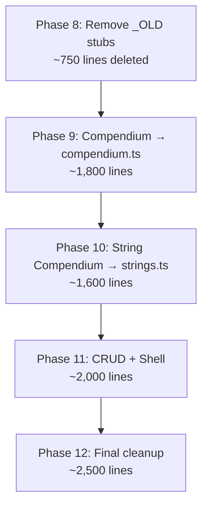

# TypeScript Migration Continuation Plan — Phases 8–12

## Current State Analysis

| Metric | Actual Value |
|--------|-------------|
| `app.js` line count | **9,353** (not 10,403 — some code already deleted) |
| TypeScript files | **35** files |
| TypeScript bytes | ~382 KB (~8,500+ lines) |
| Type errors | **0** ✅ |
| Canary tests | 5/5 (0.0 OBS drift) ✅ |
| `leaderboard.js` | 1,010 lines (still `.js`, not `.ts`) |
| Functions in `app.js` | ~130 named `function` declarations + ~30 inline arrow functions |

### What Remains in `app.js` — Functional Grouping

After thorough analysis, the remaining functions cluster into **7 logical groups**:

| Group | Functions | Lines | Complexity |
|-------|-----------|-------|------------|
| **Dead stubs (_OLD)** | 14 | ~750 | Trivial delete |
| **Racket Bible (Compendium)** | 25 | ~1,800 | High — heavy DOM, cross-calls |
| **String Compendium** | 23 | ~1,600 | High — similar to Compendium |
| **Loadout CRUD + Dock orchestration** | ~20 | ~1,200 | Medium — state management |
| **Shell (switchMode, init, boot)** | ~15 | ~800 | Medium — app-level orchestration |
| **Compare/Overview rendering** | ~30 | ~2,500 | High — heavy DOM + Chart.js |
| **Presets + Shared utils** | ~10 | ~600 | Low — mostly data manipulation |

---

## Proposed Phases

### Phase 8: Dead Code Removal (~750 lines)
**Risk: None. Zero functional impact.**

Remove all `_OLD` stub functions that were kept as reference during engine extraction. These are never called — the TS engine versions are the sole implementation.

#### Functions to delete:
| Function | Line | Lines |
|----------|------|-------|
| `__applyGaugeModifier_OLD` | 71 | ~45 |
| `_calcBaseStringProfileStub` | 122 | ~82 |
| `_calcStringFrameModStub` | 210 | ~19 |
| `__calcTensionModifier_OLD` | 243 | ~133 |
| `__calcHybridInteraction_OLD` | 399 | ~215 |
| `__predictSetup_OLD` | 634 | ~74 |
| `__generateIdentity_OLD` | 713 | ~66 |
| `generateFitProfile` (duplicate) | 784 | ~33 |
| `generateWarnings` (duplicate) | 823 | ~56 |
| `__buildTensionContext_OLD` | 2758 | ~7 |
| `__computeNoveltyBonus_OLD` | 2773 | ~47 |
| `__computeCompositeScore_OLD` | 2821 | ~97 |
| `__getSetupFromLoadout_OLD` | 1125 | ~38 |

> [!TIP]
> Also remove the section comment headers above each stub (e.g., `// GAUGE SYSTEM (imported from string-profile.js)`) to clean up the file.

**Verification**: `npm run typecheck && npm run canary && npm run build` — all must still pass.

---

### Phase 9: Racket Bible / Compendium → `src/ui/pages/compendium.ts`
**~25 functions, ~1,800 lines**

This is the **highest-value extraction** — it's the largest unmigrated page module.

#### [NEW] `src/ui/pages/compendium.ts`

| Function | Purpose |
|----------|---------|
| `initCompendium` | Initialize compendium page, wire events |
| `_extractBrand` | Extract brand name from racquet name |
| `_compSwitchTab` | Switch between Racket Bible / String Compendium tabs |
| `_compToggleHud` | Toggle frame HUD overlay |
| `_compGetFilteredRacquets` | Filter racquets by search/brand/category |
| `_compRenderRoster` | Render the racquet list sidebar |
| `_compSelectFrame` | Handle frame selection |
| `_compSyncWithActiveLoadout` | Sync compendium selection with active loadout |
| `_compRenderMain` | Render the main frame detail panel |
| `_compGenerateHeroPills` | Generate stat pills for frame hero section |
| `_compGenerateBuildReason` | Generate reason text for build card |
| `_compUpdateInjectModeUI` | Update string injection UI mode |
| `_compSetInjectMode` | Set injection mode (preview/compare) |
| `_compInitStringInjector` | Initialize string injector panel |
| `_compPopulateGaugeDropdown` | Populate gauge dropdown for injector |
| `_compPreviewStats` | Calculate and display preview stats |
| `_compRenderPreviewBars` | Render before/after stat comparison bars |
| `_compClearPreview` | Clear preview state |
| `_compApplyInjection` | Apply string injection as active loadout |
| `_compClearInjection` | Clear string injection |
| `_compGenerateTopBuilds` | Generate top builds for a frame |
| `_compPickDiverseBuilds` | Select diverse subset of builds |
| `_compRenderBuildCard` | Render a single build card |
| `_compSetSort` | Set sort mode for build cards |
| `_compCreateLoadoutFromBuild` | Create loadout from build card |
| `_compAction` | Handle build card action (Apply/Save/Compare) |
| `_compAddBuildToCompare` | Add a build to comparison |
| `_compActionCompare` | Navigate to compare with build |

#### Dependencies (imports needed):
- Engine: `predictSetup`, `computeCompositeScore`, `generateIdentity`, `buildTensionContext`, `getObsScoreColor`, `calcFrameBase`
- State: `getActiveLoadout`, `setActiveLoadout`, `getSavedLoadouts`, `getSetupFromLoadout`
- Data: `RACQUETS`, `STRINGS`, `FRAME_META`
- Constants: `STAT_KEYS`, `STAT_LABELS`, `GAUGE_LABELS`
- Components: `createSearchableSelect`, `ssInstances`
- Presets: `generateTopBuilds`, `pickDiverseBuilds`, `generateBuildReason`, `ARCHETYPE_COLORS`
- Shared: `showFrameSpecs`, `populateGaugeDropdown`, `getFrameSpecs`, `applyGaugeModifier`

> [!WARNING]
> The compendium has heavy cross-dependencies with `app.js` — specifically `activateLoadout`, `saveLoadout`, `switchMode`, `comparisonSlots`, `getCurrentSetup`. These will need to be passed as callbacks or imported from the upcoming shell module.

#### Strategy:
The compendium functions reference `activateLoadout()`, `saveLoadout()`, `switchMode()`, `comparisonSlots`, etc. which still live in `app.js`. Two options:

**Option A (Recommended)**: Import directly from `app.js` — this creates a temporary circular dependency that Vite handles fine for runtime, and will resolve when we extract the shell in Phase 11.

**Option B**: Pass dependencies via an `initCompendium(deps)` pattern — cleaner but more boilerplate.

---

### Phase 10: String Compendium → `src/ui/pages/strings.ts`
**~23 functions, ~1,600 lines**

Nearly identical pattern to Phase 9. The String Compendium is the second large page module.

#### [NEW] `src/ui/pages/strings.ts`

| Function | Purpose |
|----------|---------|
| `_stringToggleHud` | Toggle string HUD panel |
| `_stringGetFilteredStrings` | Filter strings by search/type/material |
| `_stringSyncWithActiveLoadout` | Sync string selection with active loadout |
| `_stringRenderRoster` | Render string list sidebar |
| `_stringGetArchetype` | Classify string archetype |
| `_stringSelectString` | Handle string selection |
| `_stringGeneratePills` | Generate stat pills for string |
| `_stringRenderBatteryBars` | Render battery-style stat bars |
| `_stringFindSimilarStrings` | Find strings with similar profiles |
| `_stringFindBestFrames` | Find best-performing frames for string |
| `_stringRenderMain` | Render main string detail panel |
| `_stringInitModulator` | Initialize string modulator panel |
| `_stringSetModMode` | Set modulator mode |
| `_stringOnCrossesStringChange` | Handle crosses string change |
| `_stringOnCrossesGaugeChange` | Handle crosses gauge change |
| `_stringOnFrameChange` | Handle frame change in modulator |
| `_stringOnGaugeChange` | Handle gauge change |
| `_stringOnTensionChange` | Handle tension input change |
| `_stringUpdatePreview` | Calculate and display preview |
| `_stringRenderPreviewBars` | Render before/after comparison |
| `_stringClearPreview` | Clear preview state |
| `_stringAddToLoadout` | Create loadout from string modulator |
| `_stringSetActiveLoadout` | Set string as active loadout |

#### Dependencies: Same import set as Compendium, plus `calcBaseStringProfile`, `calcStringFrameMod`.

---

### Phase 11: Loadout CRUD + Shell → `src/state/loadout-ops.ts` + `src/ui/pages/shell.ts`
**~35 functions, ~2,000 lines**

This is the **riskiest phase** — these functions are the nervous system of the app.

#### [NEW] `src/state/loadout-ops.ts` — Loadout lifecycle operations
| Function | Lines |
|----------|-------|
| `createLoadout` | ~60 |
| `activateLoadout` | ~30 |
| `saveLoadout` | ~16 |
| `removeLoadout` | ~6 |
| `switchToLoadout` | ~8 |
| `saveActiveLoadout` | ~5 |
| `duplicateActiveLoadout` | ~8 |
| `resetActiveLoadout` | ~40 |
| `hydrateDock` | ~35 |
| `commitEditorToLoadout` | ~60 |
| `getCurrentSetup` | ~6 |
| `_getSetupFromEditorDOM` | ~60 |
| `shareLoadout` | ~8 |
| `shareActiveLoadout` | ~3 |
| `exportLoadouts` | ~2 |
| `importLoadouts` | ~20 |
| `_handleSharedBuildURL` | ~30 |
| `addLoadoutToCompare` | ~18 |

#### [NEW] `src/ui/pages/shell.ts` — App shell & mode management
| Function | Lines |
|----------|-------|
| `switchMode` | ~110 |
| `init` | ~80 |
| `handleResponsiveHeader` | ~variable |
| `_initLandingSearch` | ~variable |
| `toggleTheme` (wrapper) | ~35 |
| `_onEditorChange` | ~10 |
| `_handleHybridToggle` | ~20 |
| `setHybridMode` | ~60 |
| `openTuneForSlot` | ~35 |
| `tuneSandboxCommit` | ~20 |
| `_syncOptimizeFrame` | ~8 |

> [!IMPORTANT]
> **This phase requires careful ordering.** The shell module imports everything else, and everything else imports from the shell. The key insight is: `shell.ts` re-exports operational functions to the window bridge. It should be the last thing extracted from `app.js`.

#### Circular Dependency Resolution Strategy:
Move `comparisonSlots`, `comparisonRadarChart`, `SLOT_COLORS`, `currentMode`, and other shared state variables to a dedicated `src/state/app-state.ts` module that both the shell and page modules can import from.

---

### Phase 12: Final Cleanup — Compare/Overview Rendering + Dashboard
**~30 functions, ~2,500 lines**

The remaining bulk in `app.js` is rendering functions that are already partially duplicated in TypeScript modules. This phase extracts or deduplicates:

#### Compare rendering (still in `app.js`, overlap with `compare.ts`):
Many compare functions exist in both `app.js` and `src/ui/pages/compare.ts`. The app.js versions are the "real" ones, and the TS versions are shadowed. This phase:
1. Confirms the TS versions handle all cases
2. Removes the `app.js` versions
3. Updates bridging

#### Overview rendering (still in `app.js`, overlap with `overview.ts`):
Same pattern — `renderDashboard`, `renderOverviewHero`, `renderStatBars`, `renderRadarChart`, `renderFitProfile`, `renderWarnings` etc. exist in both files.

#### Presets:
`loadPresetsFromStorage`, `savePresetsToStorage`, `renderHomePresets`, `saveCurrentAsPreset`, `loadPresetFromData`, `renderComparisonPresets`, etc. → move to `src/ui/shared/presets.ts` (merge with existing).

#### After Phase 12, `app.js` should contain only:
```javascript
// app.js — Thin shell (~200 lines)
import { ... } from './src/...';

// Module-scoped state variables
let currentRadarChart = null;
let comparisonRadarChart = null;

// DOMContentLoaded + init()
// export { ... }
```

---

## Execution Order & Dependencies



> [!NOTE]
> Each phase must pass all three gates before proceeding:
> 1. `npm run typecheck` — 0 errors
> 2. `npm run canary` — 5/5, 0.0 drift
> 3. Manual smoke test — load site, create loadout, switch modes

---

## Risk Zones

| Risk | Impact | Mitigation |
|------|--------|------------|
| `comparisonSlots` is mutated everywhere | Compare breaks | Move to `app-state.ts` as exported mutable reference |
| `switchMode` is called from 25+ inline `onclick` handlers | Navigation breaks | Ensure window bridge in `main.js` catches all |
| `Chart.js` instances (`currentRadarChart`, `comparisonRadarChart`) | Memory leaks | Keep as module-level refs in shell or compare module |
| `ssInstances` shared across all modules | Stale references | Already exported from `searchable-select.ts` — verified stable |
| `leaderboard.js` still JavaScript | Inconsistency | Convert in a companion PR but lower priority |

---

## Leaderboard.js Note

`src/ui/pages/leaderboard.js` (1,010 lines) was marked as ✅ in the checklist but is still `.js`, not `.ts`. It uses an `initLeaderboardApp(App)` dependency-injection pattern. Converting it to TypeScript is straightforward but separate from the app.js migration. Recommend as **Phase 12b** or a parallel PR.

---

## Updated Metrics Projection

| Metric | Current | After Phase 8 | After Phase 12 |
|--------|---------|---------------|----------------|
| `app.js` lines | 9,353 | ~8,600 | ~200–300 |
| TS files | 35 | 35 | ~40 |
| TS lines | ~8,500 | ~8,500 | ~17,000+ |
| Functions in `app.js` | ~130 | ~116 | ~5–10 |

---

## Open Questions

> [!IMPORTANT]
> **Q1: Dependency injection vs direct imports for Compendium/String Compendium?**
> Option A: Import `activateLoadout`, `switchMode`, etc. directly from `app.js` (creates temporary circular imports that Vite resolves at runtime).
> Option B: Use `initCompendium(deps)` pattern (cleaner but more boilerplate).
> **Recommendation**: Option A for speed, since Phase 11 will resolve the circularity.

> [!IMPORTANT]
> **Q2: Should we convert `leaderboard.js` to TypeScript as part of this plan or defer?**
> It's self-contained (1,010 lines) and uses dependency injection already. Could be done in any phase.

> [!IMPORTANT]
> **Q3: Phase execution cadence — should we do all 5 phases in one session, or commit after each phase?**
> **Recommendation**: Commit after each phase for safety. Each phase is independently verifiable.

---

## Verification Plan

### Automated Tests
```bash
npm run typecheck   # Must pass with 0 errors
npm run canary      # Must pass 5/5 with 0.0 OBS drift
npm run build       # Must complete without errors
```

### Browser Smoke Test (after each phase)
- [ ] Load site on `localhost:4000`
- [ ] Toggle dark/light mode
- [ ] Create a loadout from dock editor
- [ ] Navigate to Racket Bible → select a frame → inject a string
- [ ] Navigate to String Compendium → select a string → modulate
- [ ] Switch to Tune → verify tension curve renders
- [ ] Switch to Compare → add slots → verify radar chart
- [ ] Switch to Optimize → run optimizer
- [ ] Save/duplicate/reset loadout
- [ ] Share URL → open in new tab → verify import
